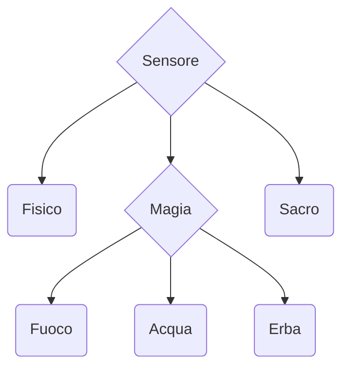

# Scopo
Realizzare un sensoreDanno che registra il numero di danni in base alla tipologia Fisico, oscuro, sacro, neutro, emotivo.
In ogni turno vengono registrati una serie di danni, il sensore registra la variazione a seconda della tipologia selezionata. E' possibile creare, eliminare e modificare il sensore.
Deve essere fornita la ricerca di un sensore tramite nome o id.
Non è richiesta la simulazione turno per turno ma si può invece simulare una serie di turni.
Nella asse delle x del Qchart vado a segnare i turni mentre nella asse y vado a segnare il quantitativo di **quel** tipo di danno ricevuto ad ogni turno.

---
## Definizione delle gerarchia

---
## Definizione delle classi

### Classe *Astratta* SensoreDanno
**Campi Dati:**
- double danno
- int probHit %
- int probCrit %

**Metodi:**
- virtual double calcolaDanno()
- virtual double getDanno()
- virtual int getProbHit()
- virtual int getProbCrit()

---
### Classe Fisico
**Campi Dati:**
- int affilatura; % *da richiedere all'utente altrimenti random*

**Metodi:**
- int getAffilatura()

---
### Classe *Astratta* Magico
**Campi Dati:**
- int lvMagia
- string status

**Metodi:**
- virtual int getLvMagia()
- virtual string getStatus()
- virtual setStatus() /*se il danno ad esempio è magiore del 20 allora setto lo stato bruciato/annegato/legato*/ specifico solo per la magia

---
### Classe Fuoco
**Campi Dati:**

**Metodi:**
*override*
---
### Classe Acqua
**Campi Dati:**

**Metodi:**
*ovverride*
---
### Classe Erba
**Campi Dati:**

**Metodi:**
*ovverride*
---
### Classe Sacro
**Campi Dati:**
- int lvFede
- int limitBreak *quando il parametro raggiunge 10 hai vinto la partita, mostra*

**Metodi:**
- getLvFede()
- getlimitBreak()
- bool checkLimit()
---