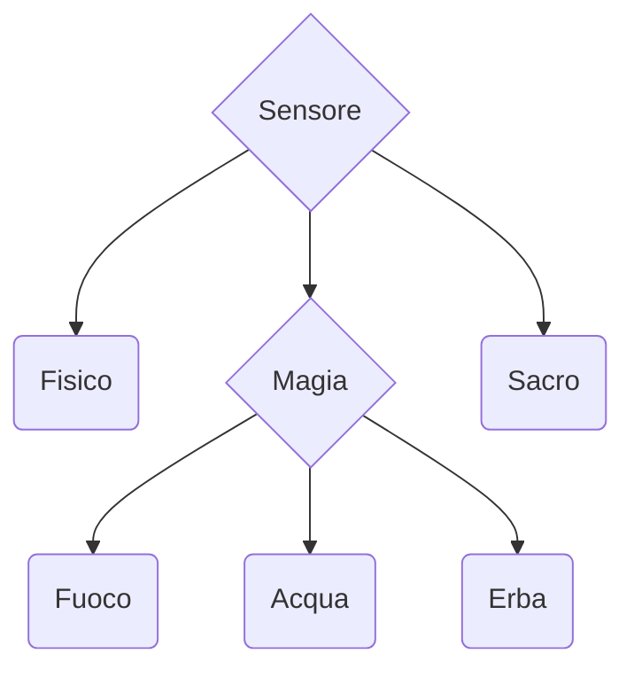

# Scopo
Realizzare un sensoreDanno che registra il numero di danni in base alla tipologia Fisico, oscuro, sacro, neutro, emotivo.
In ogni turno vengono registrati una serie di danni, il sensore registra la variazione a seconda della tipologia selezionata. E' possibile creare, eliminare e modificare il sensore.
Deve essere fornita la ricerca di un sensore tramite nome o id.
Non è richiesta la simulazione turno per turno ma si può invece simulare una serie di turni.
---
## Definizione delle gerarchia

---
## Definizione delle classi

### Classe *Astratta* SensoreDanno
**Campi Dati:**

**Metodi:**

---
### Classe Fisico
**Campi Dati:**

**Metodi:**

---
### Classe *Astratta* Magico
**Campi Dati:**

**Metodi:**

---
### Classe Fuoco
**Campi Dati:**

**Metodi:**

---
### Classe Acqua
**Campi Dati:**

**Metodi:**

---
### Classe Erba
**Campi Dati:**

**Metodi:**

---
### Classe Sacro
**Campi Dati:**

**Metodi:**

---